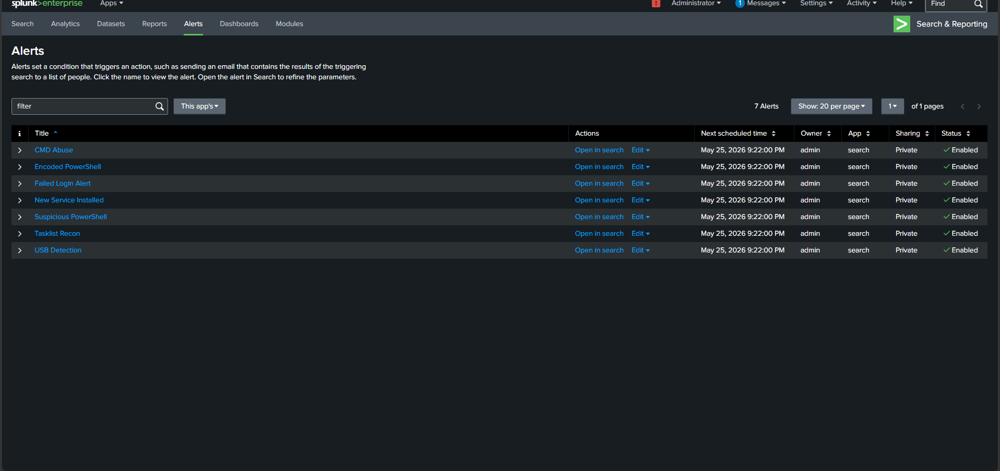
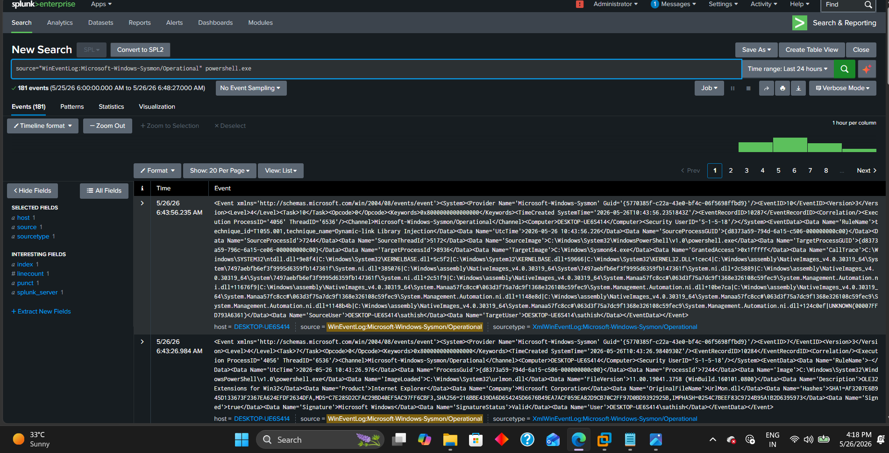
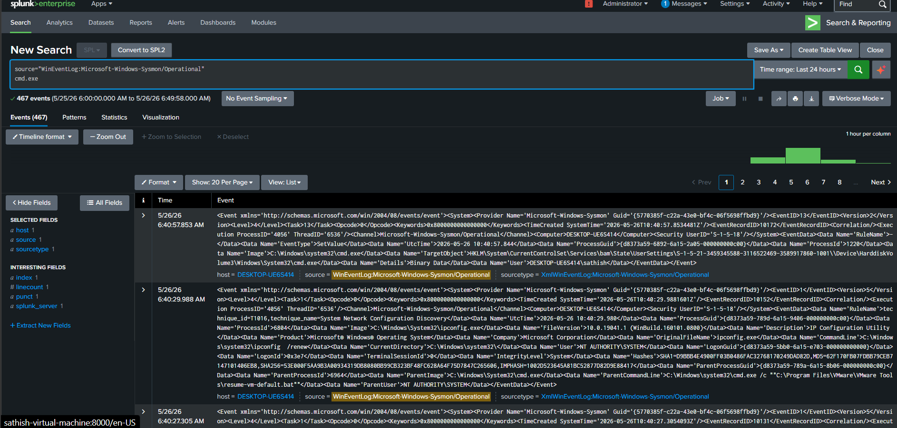
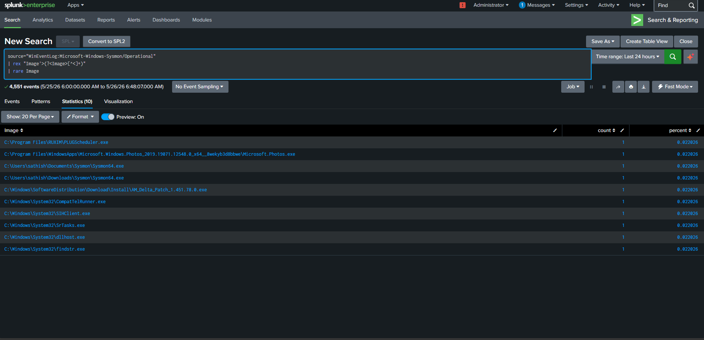
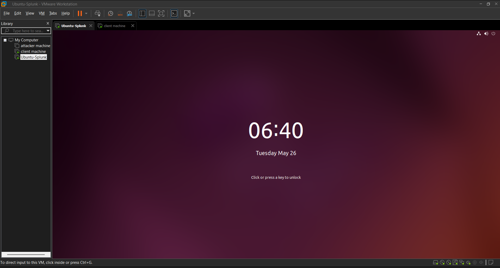

# Insider Threat Detection Lab using Splunk & Sysmon

## Overview
This project is a hands-on SOC (Security Operations Center) lab built using Splunk Enterprise, Sysmon, Windows telemetry, and VMware. The lab focuses on detecting insider threats, suspicious command execution, PowerShell abuse, reconnaissance activity, and unusual process behavior using real-time monitoring and alerting.

---

## Lab Architecture

- Attacker Machine
- Windows 10 Endpoint
- Splunk Enterprise SIEM
- Sysmon Logging
- Splunk Universal Forwarder
- VMware Virtual Environment

---

## Tools & Technologies Used

- Splunk Enterprise
- Sysmon
- Windows 10
- VMware Workstation
- Splunk Universal Forwarder
- PowerShell
- CMD
- MITRE ATT&CK Framework

---

## Key Features

### Endpoint Monitoring
- Real-time process monitoring
- Windows event log collection
- Sysmon telemetry analysis

### Threat Detection
- Suspicious PowerShell execution
- CMD abuse detection
- Rare process detection
- Reconnaissance command monitoring
- Failed login monitoring

### Dashboard Visualizations
- Top Running Processes
- PowerShell Activity
- CMD Execution Timeline
- Rare Process Detection
- Suspicious Commands

### Alerting
- Failed Login Alert
- PowerShell Detection Alert
- CMD Abuse Alert
- Reconnaissance Detection Alert

---

## Sample SPL Queries

### Top Running Processes
```spl
source="WinEventLog:Microsoft-Windows-Sysmon/Operational"
| rex "Image\">(?<Image>[^<]+)"
| stats count by Image
| sort -count
```
### PowerShell Detection
```
source="WinEventLog:Microsoft-Windows-Sysmon/Operational" powershell.exe
```
### CMD Execution Monitoring
```
source="WinEventLog:Microsoft-Windows-Sysmon/Operational" cmd.exe
```
### Reconnaissance Command Detection
```
source="WinEventLog:Microsoft-Windows-Sysmon/Operational" whoami OR tasklist OR ipconfig
```
### Rare Process Detection
```
source="WinEventLog:Microsoft-Windows-Sysmon/Operational"
| rex "Image\">(?<Image>[^<]+)"
| rare Image
```
---
## MITRE ATT&CK Mapping

| Technique | Description |
|---|---|
| T1059 | Command and Scripting Interpreter |
| T1087 | Account Discovery |
| T1082 | System Information Discovery |
| T1055 | Process Injection |
| T1047 | Windows Management Instrumentation |
---
## Screenshots

### Dashboard Overview


### Alert Configuration


### Sysmon Event Logs


### PowerShell Detection


### CMD Detection


### Reconnaissance Detection


### Rare Process Detection


### VMware Lab Setup

---
## Learning Outcomes

- SIEM dashboard creation
- Windows log analysis
- Sysmon event monitoring
- Threat hunting techniques
- Splunk SPL query writing
- Alert configuration
- MITRE ATT&CK mapping
- SOC workflow understanding

---

## Future Improvements

- Wazuh integration
- Email alerting
- Brute force attack simulation
- Phishing detection use cases
- Threat intelligence integration
- Automated incident response

---

## Author

**Sathish Muneeswaran**

Cybersecurity Enthusiast | SOC Analyst Aspirant
